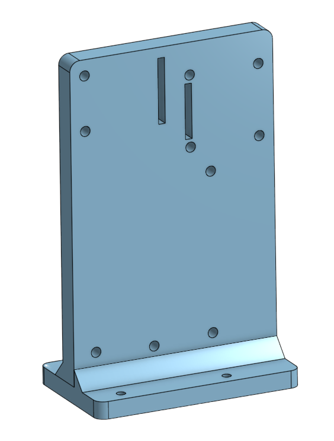
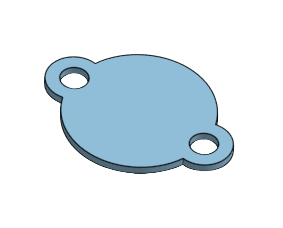
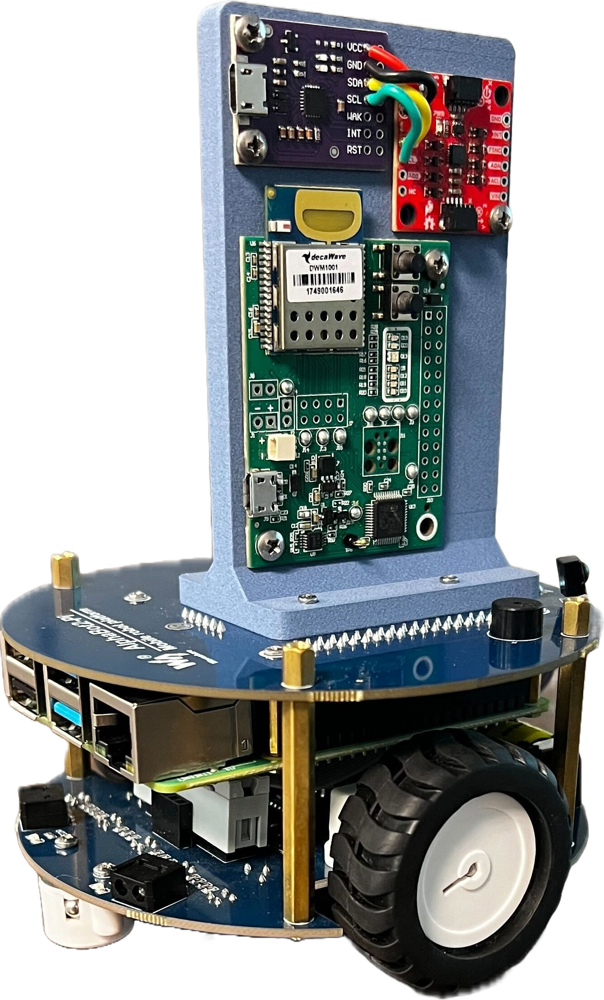

# alphabot_swarm
Code to deploy on AlphaBots to test the STTR swarm control algorithms.  
Initial work performed by **RI** for STTR Phase 2E.

---

## Requirements

### Hardware
- 4 × AlphaBot2-Pi 
- 8 × Decawave MDEK1001 (UWB sensor)   
- 4 × SparkFun ICM-20948 (IMU)  
- 4 × CP2112 (I2C–USB Converter)

### 3D Printed Parts
- 4 x Mount for UWB, IMU, and I2C-USB converter
 

- 8 x Spacer for ball casters


**Note:** Spacers may need to be adjusted by +-1mm due to AlphaBot2-Pi tolerance 

## Robot Preview


## Setup

### Ultra-Wideband Sensors
1. Download the **Decawave Software Package**.  
2. Flash the UWB sensors using **J-Flash Lite**.  
3. Use the **Decawave Android app** to configure sensors as anchors or tags. The maximum anchors allowed in the software is 4.

📖 Full guide: [Precise Real-Time Indoor Localization with Raspberry Pi and UWB](https://medium.com/@newforestberlin/precise-realtime-indoor-localization-with-raspberry-pi-and-ultra-wideband-technology-decawave-191e4e2daa8c) 

### Swarm Controller (for programs in /commands)
1. Compile: make swarm_child.cpp and swarm_controller
2. Run ./swarm_controller on all robots 
3. Run ./swarm_child on all robots

**Note:** For more ideal trajectories, all robots must be setup starting at 0 degrees (facing +x-direction) 

---

### Programs:
1. ssh_keyboard_drive.py: Control robot with WASD
2. imu.py: Reads orientation data using IMU 
3. uwb.py: Reads x,y position data using UWB sensors
4. positions_udp_main.py: Receives x,y position commands via UDP
5. vector_udp_main.py: Receives x,y vector commands via UDP

### Known Limitations:
1. IMU-based angle estimation drifts over time
2. UWB sensors may ocassionally require a restart (unplug/replug)
3. If UWB sensors stop receiving telemetry: reinitialize by running /position_estimation/uwb.py

1. Must initialize UWB sensors by running /position_estimation/uwb.py before running any code
2. IMU-based angle estimation drifts over time
3. UWB sensors may ocassionally go down and require a restart (unplug/replug)

## Configure & Build
This repo uses CMakePresets for its build configurations.

See the available presets by running the following in the root folder of the project:
```
cmake --list-presets
cmake --build --list-presets
```
Example configuration and build for the `linux-debug` preset:
```
cmake --preset linux-debug
cmake --build --preset linux-debug -j4
```

# Installing the RPI Cross-compiler
The Raspberry PI on the AlphaBot uses version 2.36 of GLIBC, so the latest version of the toolchain we can use is version 12.
```
localuser@raspberrypi:~ $ ldd --version
ldd (Debian GLIBC 2.36-9+rpt2+deb12u7) 2.36
Copyright (C) 2022 Free Software Foundation, Inc.
This is free software; see the source for copying conditions.  There is NO
warranty; not even for MERCHANTABILITY or FITNESS FOR A PARTICULAR PURPOSE.
Written by Roland McGrath and Ulrich Drepper.
```

The toolchain can be found here: https://developer.arm.com/downloads/-/arm-gnu-toolchain-downloads

Arm GNU Toolchain
Version 12.2.Rel1
x86_64 Linux hosted cross toolchains
AArch32 GNU/Linux target with hard float (arm-none-linux-gnueabihf)

Change folders to the /opt folder to use as the root install directory for toolchains:
```
cd /opt
```
Download the toolchain:
```
sudo wget https://developer.arm.com/-/media/Files/downloads/gnu/12.2.rel1/binrel/arm-gnu-toolchain-12.2.rel1-x86_64-arm-none-linux-gnueabihf.tar.xz
```
Extract:
```
sudo tar xvf arm-gnu-toolchain-12.2.rel1-x86_64-arm-none-linux-gnueabihf.tar.xz
```
Remove the compressed file, which we no longer need:
```
sudo rm arm-gnu-toolchain-12.2.rel1-x86_64-arm-none-linux-gnueabihf.tar.xz
```

